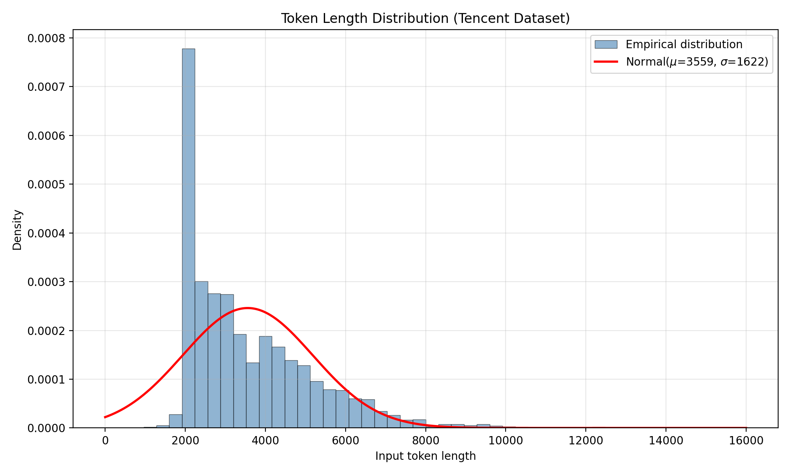

# 说明
对标阿里和腾讯的对deepseek-r1的推理技术的评测。

环境依赖：`sglang==0.5.7`

## 阿里评测
```shell
python3 main.py --model /nfs/FM/gongoubo/checkpoints/Qwen/Qwen3-30B-A3B-Instruct-2507 --base_url http://192.168.16.21:18000 --eval_type decode --eval_method ali --decode_gpu_num 1 --deploy_log /nfs/FM/gongoubo/new_project/workflow/deepseek_bench/logs/test.log --output_path /nfs/FM/gongoubo/new_project/workflow/deepseek_bench/output/ali_decode.json

python3 main.py --model /nfs/FM/gongoubo/checkpoints/Qwen/Qwen3-30B-A3B-Instruct-2507 --base_url http://192.168.16.21:18000 --eval_type prefill --eval_method ali --prefill_gpu_num 1 --output_path /nfs/FM/gongoubo/new_project/workflow/deepseek_bench/output/ali_prefill.json
```
- --xxx_gpu_num：部署所用的GPU显卡数目
- --deploy_log：部署服务需要使用nohup将日志记录到log里面，多个log用英文`,`隔开。
- --output_path：结果保存的路径。

需要下载ShareGPT_V3_unfiltered_cleaned_split.json，然后指定--dataset_path。

注意：先进行deocde的评测，再进行prefill的评测。

decode结果：
```json
[
    {
        "1": 7.06,
        "2": 9.37,
        "4": 13.57,
        "8": 18.81,
        "12": 22.86,
        "16": 25.78,
        "20": 27.04,
        "24": 26.02,
        "28": 26.12,
        "32": 26.54,
        "40": 27.04,
        "48": 26.63,
        "56": 29.17,
        "64": 28.52
    },
    {
        "1": {
            "median": 141.67,
            "throughput_per_gpu": 141.67,
            "throughput_per_user": 141.67,
            "gen_througput_samples": 419
        },
        "2": {
            "median": 215.565,
            "throughput_per_gpu": 215.565,
            "throughput_per_user": 107.7825,
            "gen_througput_samples": 186
        },
        "4": {
            "median": 298.38,
            "throughput_per_gpu": 298.38,
            "throughput_per_user": 74.595,
            "gen_througput_samples": 128
        },
        "8": {
            "median": 432.87,
            "throughput_per_gpu": 432.87,
            "throughput_per_user": 54.10875,
            "gen_througput_samples": 124
        },
        "12": {
            "median": 528.825,
            "throughput_per_gpu": 528.825,
            "throughput_per_user": 44.06875,
            "gen_througput_samples": 90
        },
        "16": {
            "median": 623.81,
            "throughput_per_gpu": 623.81,
            "throughput_per_user": 38.988125,
            "gen_througput_samples": 76
        },
        "18": {
            "median": 660.02,
            "throughput_per_gpu": 660.02,
            "throughput_per_user": 36.66777777777778,
            "gen_througput_samples": 564
        },
        "17": {
            "median": 598.905,
            "throughput_per_gpu": 598.905,
            "throughput_per_user": 35.22970588235294,
            "gen_througput_samples": 212
        },
        "3": {
            "median": 235.79,
            "throughput_per_gpu": 235.79,
            "throughput_per_user": 78.59666666666666,
            "gen_througput_samples": 66
        },
        "7": {
            "median": 439.12,
            "throughput_per_gpu": 439.12,
            "throughput_per_user": 62.73142857142857,
            "gen_througput_samples": 16
        },
        "6": {
            "median": 357.59,
            "throughput_per_gpu": 357.59,
            "throughput_per_user": 59.59833333333333,
            "gen_througput_samples": 74
        },
        "11": {
            "median": 521.0999999999999,
            "throughput_per_gpu": 521.0999999999999,
            "throughput_per_user": 47.37272727272727,
            "gen_througput_samples": 66
        },
        "10": {
            "median": 491.53,
            "throughput_per_gpu": 491.53,
            "throughput_per_user": 49.153,
            "gen_througput_samples": 72
        },
        "15": {
            "median": 688.38,
            "throughput_per_gpu": 688.38,
            "throughput_per_user": 45.892,
            "gen_througput_samples": 16
        },
        "14": {
            "median": 621.69,
            "throughput_per_gpu": 621.69,
            "throughput_per_user": 44.40642857142858,
            "gen_througput_samples": 74
        },
        "19": {
            "median": 782.62,
            "throughput_per_gpu": 782.62,
            "throughput_per_user": 41.19052631578948,
            "gen_througput_samples": 292
        },
        "5": {
            "median": 291.71500000000003,
            "throughput_per_gpu": 291.71500000000003,
            "throughput_per_user": 58.343,
            "gen_througput_samples": 14
        },
        "13": {
            "median": 546.14,
            "throughput_per_gpu": 546.14,
            "throughput_per_user": 42.01076923076923,
            "gen_througput_samples": 14
        },
        "9": {
            "median": 450.96,
            "throughput_per_gpu": 450.96,
            "throughput_per_user": 50.10666666666666,
            "gen_througput_samples": 2
        }
    }
]
```
- 第一个字典是batch_size对应的TPOP（ms）。
- 第二个字典是throughput_per_gpu和throughput_per_user对应关系（tokens/s）。

prefill结果：
```json
[
    {
        "1024": 25574.94,
        "2048": 24486.29,
        "4096": 22403.85
    }
]
```
- 在1k,2k,4k设置下的Input Throughput Per GPU (tokens/s)。

## 腾讯评测

腾讯报告披露测试数据集: 3000条业务脱敏数据集(最大输入16k，平均输入3.5k；最大输出32k， 平均输出1.2k)


生成的数据分布：

[analyze] 最终数据集 token 统计:
- 样本数: 3000
- 平均值: 3558.80
- 标准差: 1622.37
- 中位数: 3040.00
- 最小值: 968
- 最大值: 15673



评测脚本：
```shell

python3 main.py --model /nfs/FM/gongoubo/checkpoints/Qwen/Qwen3-30B-A3B-Instruct-2507 --base_url http://192.168.16.21:18000  --eval_method tencent --output_path /nfs/FM/gongoubo/new_project/workflow/deepseek_bench/output/tencent.json --dataset_path /nfs/FM/gongoubo/new_project/workflow/deepseek_bench/data/sharegpt_normal_distribution_3000.json --output_len 1200 --batch_size 3000
```
- 由于sharegpt里可能存在某些敏感内容，因此数据在本地，需要自行下载。
- 这里限制输出为1.2k。
- 一次性输入3000条数据并行请求，具体执行多少请求由部署服务决定。

输出样例：
```json
[
    {
        "tpot (ms)": "6.80",
        "ttft (ms)": "54.52",
        "input_throughput (tok/s)": "32.57",
        "output_throughput (tok/s)": "145.85",
        "total_throughput (tok/s)": "178.43",
        "QPM (req/min)": 7.199999999999999
    }
]
```
